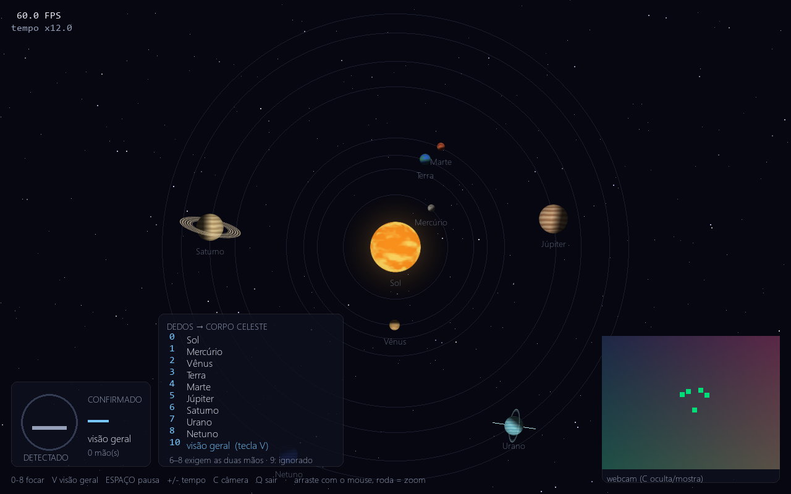
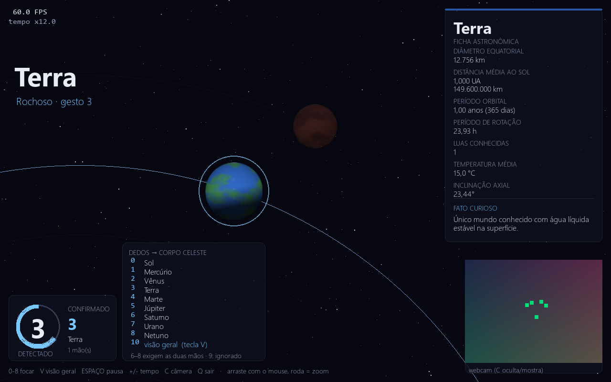
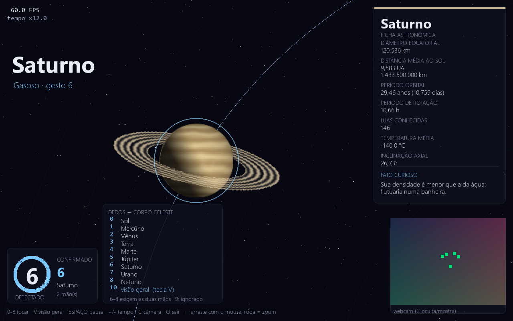

# Sistema Solar Interativo por Gestos

Aplicação desktop em Python que renderiza o Sistema Solar animado e deixa você
**selecionar um corpo celeste mostrando um número com a mão** para a webcam. Ao
confirmar o gesto, a câmera faz zoom/pan suave até o alvo, escreve o nome dele em
destaque e abre uma ficha com os dados astronômicos.

Roda 100% local: sem internet em execução, sem serviços pagos e sem nenhuma
imagem de terceiros — todas as texturas dos planetas são geradas por código.



| Foco na Terra (3 dedos) | Foco em Saturno (5 + 1 dedos) |
|---|---|
|  |  |

---

## Instalação

Testado com **Python 3.12.10** no Windows 11 Pro. Compatível com Python 3.11+.

```bash
cd sistema_solar_gestos
python -m venv .venv
# Windows
.venv\Scripts\activate
# Linux/macOS
source .venv/bin/activate

pip install -r requirements.txt
python main.py
```

Sem ativar o ambiente, dá para chamar o interpretador do venv direto:

```powershell
.venv\Scripts\python.exe main.py

# se houver mais de uma webcam no computador
.venv\Scripts\python.exe main.py --camera 1
```

Não há passo manual extra: o modelo de mãos vem embutido no wheel do MediaPipe,
nada é baixado na primeira execução.

### Dependências

| Pacote | Versão | Papel |
|---|---|---|
| `mediapipe` | 0.10.14 | detecção dos 21 landmarks da mão |
| `opencv-python` | 4.10.0.84 | captura da webcam e pré-processamento |
| `pygame` | 2.6.1 | janela, render 2D e entrada de teclado |
| `numpy` | 1.26.4 | geração procedural das texturas |

> **Por que MediaPipe 0.10.14 e não a mais nova?** A partir da 0.10.31 o wheel
> virou "tasks only": `mp.solutions.hands` deixou de existir e o `HandLandmarker`
> passa a exigir o download de um arquivo `.task` — o que quebraria o requisito
> de zero chamadas de rede em runtime. A 0.10.14 é a última linha que traz as
> *legacy solutions* com o modelo embutido.

---

## Duas versões, a mesma aplicação

| | Onde | Como rodar |
|---|---|---|
| **Desktop** | esta pasta | `SistemaSolar.exe` ou `.venv\Scripts\python.exe main.py` |
| **Web** | [`web/`](web/) | abre no navegador, inclusive no celular — veja o [README da web](web/README.md) |

As duas têm os mesmos corpos, os mesmos gestos, a mesma estabilização e as
mesmas fichas. **Toda alteração feita em um lado precisa ser feita no outro** —
e isso é verificado por script, não por disciplina:

```powershell
.venv\Scripts\python.exe verificar_paridade.py   # confere os dois lados
.venv\Scripts\python.exe publicar.py             # verifica + regenera o download
```

O `publicar.py` também regenera o ZIP que o site oferece em "Baixar versão
desktop", garantindo que quem baixa recebe a mesma `VERSAO` que está no ar.
O histórico de implementações fica em [TAREFAS.md](TAREFAS.md) e o que ainda
falta, em [ROADMAP.md](ROADMAP.md).

---

## Executável (Windows)

Para rodar sem mexer em Python, use o **`SistemaSolar.exe`** na raiz do projeto:
é só dar um duplo clique. Ele abre em ~2 s e não precisa de ambiente virtual,
mas **depende da pasta `_internal_sistema_solar/` ao lado** — as duas coisas
viajam juntas se você copiar para outro lugar.

Para gerar de novo (depois de mudar o código):

```powershell
.venv\Scripts\python.exe -m pip install pyinstaller
.venv\Scripts\python.exe build_exe.py
```

O build leva ~3 min e ocupa ~350 MB, quase tudo do MediaPipe e do OpenCV. O
script já exclui `jax`, `jaxlib` e `scipy` (declarados pelo MediaPipe mas nunca
executados pelo Hands), o que corta mais de 600 MB. `matplotlib` **não** pode ser
excluído: `mp.solutions.drawing_utils` o importa no topo do módulo, e sem ele o
executável sobe em modo teclado, sem gestos.

A janela de console que acompanha o executável é proposital — é nela que saem as
mensagens `[webcam]`. Para gerar sem console, troque `--console` por
`--windowed` em [build_exe.py](build_exe.py).

---

## Gestos

Conte os dedos levantados **somando as duas mãos visíveis**:

| Dedos | Corpo celeste |
|:---:|---|
| 0 (mão fechada) | Sol |
| 1 | Mercúrio |
| 2 | Vênus |
| 3 | Terra |
| 4 | Marte |
| 5 (mão aberta) | Júpiter |
| 6 | Saturno |
| 7 | Urano |
| 8 | Netuno |
| 9 | Lua (satélite da Terra) |
| **10 (duas mãos abertas)** | **volta à visão geral do sistema** |

**Uma mão só chega a 5.** Para 6, 7, 8 e 9 use as duas mãos — por exemplo
`5 + 1 = 6` (Saturno) ou `5 + 4 = 9` (Lua). Isso não é uma limitação do
reconhecimento: é aritmética de dedos, e o HUD lembra disso sempre que você
está mostrando 5.

O painel do canto inferior esquerdo mostra o que cada mão está lendo
(`2 mão(s): 5+1`). Se aparecer `1 mão(s): 5` quando você está usando as duas, a
segunda mão não está sendo vista — aproxime-a da primeira, deixe as duas na
mesma distância da câmera e evite encostar nas bordas do quadro.

**Abrir as duas mãos (5 + 5 = 10) é o gesto de comando** que desfaz o foco e
reenquadra o sistema inteiro — o equivalente da tecla `V`, sem tocar no teclado.
Ele passa pela mesma confirmação por maioria dos demais, então não dispara por
acidente ao você trocar de pose.

### Como o gesto é confirmado

Reconhecimento cru pisca entre valores vizinhos e trocaria o foco dezenas de
vezes por segundo. A leitura passa por três filtros antes de virar uma troca:

1. **Buffer temporal** — deque com as últimas 10 *inferências* (não frames de
   render: alimentar o buffer a 60 Hz o encheria com a mesma leitura repetida).
2. **Maioria de 70%** — 7 dos 10 votos precisam concordar, o que equivale a
   segurar a pose por cerca de meio segundo.
3. **Cooldown de 0,8 s** após cada troca confirmada.

O anel azul no canto inferior esquerdo enche conforme a votação avança: é o
feedback de que basta segurar a pose mais um instante.

Ficando ~6 s sem nenhum gesto válido, a cena volta sozinha à visão geral.

---

## Janela, teclado e mouse

A janela é uma janela normal do sistema: tem os botões de **minimizar,
maximizar e fechar**, pode ser **arrastada pela barra de título** e
**redimensionada pelas bordas** — todo o layout (HUD, ficha, campo de estrelas
e enquadramento da câmera) se recalcula junto, respeitando um mínimo de
900 × 620 para os painéis não se atropelarem.

O preview da webcam fica no **canto inferior direito**, com os landmarks da mão
desenhados por cima, e some/volta com a tecla `C`.

A webcam é opcional. Se ela não abrir, o HUD avisa e o app segue por teclado.

| Tecla | Ação |
|---|---|
| `0`–`8` | seleciona o corpo celeste |
| `9` ou `L` | foca a **L**ua |
| `V` | volta à **v**isão geral (equivale ao gesto das duas mãos abertas) |
| `A` | abre o **Quiz & Atividades** interativo nativo (10 questões) |
| `R` | abre o **Ranking** de pontuações no navegador |
| `N` | ativa / desativa a **n**arração por voz (TTS) |
| `ESPAÇO` | pausa / retoma a animação |
| `+` / `-` | acelera / desacelera o tempo |
| `C` | mostra / oculta o preview da webcam |
| `ESC` ou `Q` | sair (ou fechar o quiz se estiver aberto) |

| Mouse | Ação |
|---|---|
| arrastar com o botão esquerdo | pan livre pela cena |
| roda | zoom in / out (ou rolar respostas no quiz) |
| clique na assinatura | abre o perfil do autor no navegador |

Assumir a câmera com o mouse suspende o rastreamento automático (a ficha do
planeta continua aberta). O próximo gesto confirmado, `V` ou uma tecla de
0 a 8 devolvem o controle à aplicação.

---

## Atividades, Quiz & Ranking

Tanto na versão **Desktop** (pressionando a tecla `A`) quanto na versão **Web** ([`/atividades.html`](https://interact-solar-system.vercel.app/atividades)), o projeto inclui um módulo completo de avaliação astronômica:

- **10 Questões Interativas** sobre o Sistema Solar, órbitas, temperaturas e curiosidades.
- **Identificação do Aluno** (Nome e Série/Turma) com salvamento em banco MongoDB via API.
- **Cronômetro e Barra de Progresso** em tempo real.
- **Gabarito com Rolagem (Scroll)** para revisão detalhada de erros e acertos.
- **Quadro de Honra / Ranking** ([`/ranking.html`](https://interact-solar-system.vercel.app/ranking)) com Pódio Top 3, filtro por turma, busca por aluno e gerenciamento seguro.
- **Tema Monocromático:** Alternador de **Modo Escuro (Dark) e Modo Claro (Light)** em preto & branco de alto contraste, com suporte a persistência via `localStorage`.
- **Totalmente Responsivo:** Otimizado para telas desktop, tablets e smartphones (com alvos de toque aumentados e prevenção de zoom involuntário no iOS).

---

## As escalas NÃO são realistas (e não podem ser)

Em escala linear real o Sistema Solar é indesenhável: se a órbita de Netuno
(30,07 UA) coubesse na tela, Mercúrio (0,387 UA) ficaria a ~1% do raio, colado
no Sol, e a Terra teria menos de 1 pixel. O projeto usa duas compressões
deliberadamente "erradas", ambas documentadas em `config.py`:

**1. Raio orbital — escala logarítmica.** O raio em pixels é interpolado sobre
`ln(distância em UA)`, colocando Mercúrio no raio mínimo e Netuno no máximo:

| Corpo | Real (UA) | Na tela (px) |
|---|---:|---:|
| Mercúrio | 0,387 | 95 |
| Terra | 1,000 | 166 |
| Júpiter | 5,204 | 289 |
| Netuno | 30,070 | 420 |

A ordem e a sensação de espaçamento crescente sobrevivem; as proporções, não.

**2. Raio dos corpos — lei de potência com expoente 0,40.** O raio desenhado é
`10 px × (diâmetro / diâmetro da Terra) ** 0,40`. Isso derruba a razão
Júpiter/Mercúrio de ~29x para ~3,8x — sem isso, ou Mercúrio vira um ponto de
1 px ou Júpiter ocupa meia tela. O Sol tem raio fixo (46 px) porque mesmo
comprimido ele engoliria as primeiras órbitas.

**O que é fiel:** as *proporções entre os períodos orbitais*. Um ano de Netuno
continua durando ~165 anos terrestres; `TIME_SCALE` (em `config.py`) define
quantos dias astronômicos passam por segundo real. A rotação própria também
respeita o sinal — Vênus e Urano giram ao contrário — mas é comprimida por um
fator à parte, senão Júpiter (9,93 h) viraria um borrão.

Números reais sem compressão nenhuma estão sempre na ficha do planeta.

---

## Arquitetura

```
sistema_solar_gestos/
├── main.py                  # loop principal, orquestra captura + render + quiz
├── config.py                # constantes: resolução, escalas, cores, thresholds
├── build_exe.py             # gerador do executável Windows com PyInstaller
├── empacotar_web.py         # gerador do pacote ZIP com executável e fontes
├── verificar_paridade.py    # verificador de sincronização desktop <-> web
├── requirements.txt
├── README.md
├── docs/                    # capturas usadas neste README
├── dados/
│   ├── planetas.py          # dataclass CorpoCeleste + lista com os 9 corpos
│   └── telemetria.py        # registro de sessões e ranking no MongoDB
├── nucleo/
│   ├── orbita.py            # cálculo de posição orbital ao longo do tempo
│   ├── camera.py            # zoom/pan com interpolação suave
│   └── renderizador.py      # desenho da cena
├── gestos/
│   ├── detector.py          # wrapper do MediaPipe (thread separada)
│   ├── contador.py          # landmarks → número de dedos
│   ├── estabilizador.py     # buffer, votação por maioria, cooldown
│   └── pinca.py             # zoom por gesto de pinça com a mão
└── ui/
    ├── hud.py               # overlays, indicadores, preview da câmera
    ├── ficha_planeta.py     # card de dados do planeta focado
    ├── quiz.py              # interface interativa de atividades / quiz em Pygame
    ├── narrador.py          # narração de voz com suporte a ElevenLabs e TTS local
    └── marca_dagua.py       # assinatura animada do autor (canto inferior direito)
```

### Decisões técnicas

**Captura em thread separada.** `cap.read()` é bloqueante (~33 ms a 30 fps) e a
inferência custa mais ~15 ms. Rodando tudo no loop de render, o FPS despencaria
para a taxa da webcam. A thread publica sempre a "última leitura válida" sob
lock; o loop de render só consulta, nunca espera.

**Detecção 1 a cada 2 frames.** Trade-off medido: inferência em todo frame a
30 fps consome ~46% de um núcleo. Em 1 a cada 2 frames caem para ~23% e ainda
sobram ~15 leituras/s — muito mais rápido que os ~0,5 s da confirmação, então o
usuário não percebe atraso. A alternativa (detectar sempre) está registrada em
comentário em `config.py`.

**Contagem de dedos invariante à rotação.** A regra ingênua — "ponta acima da
junta PIP em `y`" — só funciona com a mão em pé. Em vez disso montamos um
referencial da própria palma (pulso → MCP do médio como eixo "para cima",
mínimo → indicador como eixo lateral) e projetamos os dedos nele. Como o eixo
lateral sai da anatomia, ele já se inverte sozinho entre mão esquerda e direita.
O polegar usa esse eixo e, na faixa ambígua, o critério de distância
ponta/IP até a base do dedo mínimo. Todos os limiares são frações do tamanho da
palma, o que torna a contagem independente da distância até a câmera.

**Rotação própria de verdade.** Cada corpo tem uma tira equirretangular
(o mapa "desenrolado") gerada com ruído fractal, projetada em esfera via `arcsin`
nos dois eixos e pré-renderizada em 24 fases na inicialização. O terminador
dia/noite é uma máscara à parte, girada conforme a direção do Sol.

### Casos de borda tratados

| Situação | Comportamento |
|---|---|
| Webcam ausente, ocupada ou sem permissão | aviso no HUD + modo teclado; segue tentando reconectar |
| Webcam desconectada com o app aberto | libera o recurso, avisa e continua rodando |
| Nenhuma mão no quadro | mantém o último alvo confirmado |
| Mão cortada pela borda | descarta o frame inteiro em vez de contar errado |
| 3+ mãos no quadro | considera só as duas de maior confiança |
| Iluminação ruim | avisa quando a luminância média ou a confiança caem do limiar |
| Encerramento (inclusive com exceção) | `try/finally` garante `cap.release()` |

---

## Desempenho

Medido em Windows 11, Python 3.12, com a detecção ativa e a janela em 1280×800:

| Cenário | FPS de render |
|---|---:|
| Visão geral (9 corpos, órbitas, estrelas) | ~150 |
| Foco em um planeta (ficha + HUD completos) | ~96 |
| Loop completo com webcam + MediaPipe ativos | ~76 |

O loop é limitado a 60 FPS por `FPS_ALVO`; a folga acima disso é a margem para
hardware mais modesto. O alvo de 30+ FPS fica confortavelmente atendido.

---

## Fora de escopo

3D real, texturas fotográficas, luas orbitando, planetas anões, cinturão de
asteroides, empacotamento em executável e qualquer chamada de rede.

Evoluções possíveis: versão 3D com Ursina/VPython, gesto de pinça para zoom
manual e narração TTS do nome do planeta.

---

## Solução de problemas

**`ImportError: DLL load failed while importing _framework_bindings` (Windows).**
O MediaPipe depende do Microsoft Visual C++ Redistributable 2015–2022; instale-o
e reabra o terminal. O app não quebra por causa disso — ele detecta a falha na
importação e cai no modo teclado com aviso no HUD.

**A webcam não liga.** O app escreve o diagnóstico no terminal em que foi
iniciado. Procure a linha `[webcam]`:

```
[webcam] aberta no índice 0 via DirectShow (640x480)     <- funcionando
[webcam] backend DirectShow: não abriu o índice 0        <- não achou a câmera
[webcam] NÃO ABRIU — verifique se outro app está usando...
[webcam] MediaPipe indisponível: ImportError: ...        <- roda só por teclado
```

Checklist, em ordem:

1. **Interpretador certo.** `python main.py` usa o Python do sistema, que não
   tem as dependências. Rode `.venv\Scripts\python.exe main.py` (ou ative o
   ambiente antes). No VS Code, selecione o interpretador do `.venv`.
2. **Câmera livre.** Feche Teams, Zoom, navegador com videochamada — a maioria
   das webcams aceita um único cliente por vez.
3. **Permissão do Windows.** *Configurações → Privacidade e segurança → Câmera*
   → "Permitir que aplicativos da área de trabalho acessem sua câmera".
4. **Mais de uma câmera?** Tente `--camera 1` ou `--camera 2`.
5. Se o preview não aparece mas o resto funciona, você pode ter escondido o
   quadro com a tecla `C` — aperte de novo.

A imagem leva menos de 1 segundo para aparecer depois que a janela abre; até lá
o HUD mostra "Abrindo a webcam...".

**O número detectado fica oscilando.** Aumente `TAMANHO_BUFFER_GESTOS` ou
`FRACAO_MAIORIA` em `config.py`; a confirmação fica mais lenta e mais firme.

**FPS baixo.** Suba `DETECTAR_A_CADA_N_FRAMES` para 3, reduza
`LARGURA_CAPTURA`/`ALTURA_CAPTURA` ou oculte o preview da webcam com `C`.

---

## Autor

Desenvolvido por **Renan de Oliveira Farias** (Nandev).

A assinatura no canto inferior direito é a marca d'água que o autor usa na web,
portada de CSS para pygame em `ui/marca_dagua.py`: cubo wireframe em rotação,
gradiente animado no nome, partículas em órbita e varredura holográfica. Ela se
apoia no preview da webcam quando ele está visível e desce até o rodapé quando
não está. Clicar abre o perfil no navegador padrão — é a única coisa no projeto
que sai da janela, e só acontece por clique explícito; o app em si continua sem
nenhuma chamada de rede.

Texto, cores, tamanhos, ritmo das animações e a URL ficam nas constantes
`ASSINATURA_*` de `config.py`.
